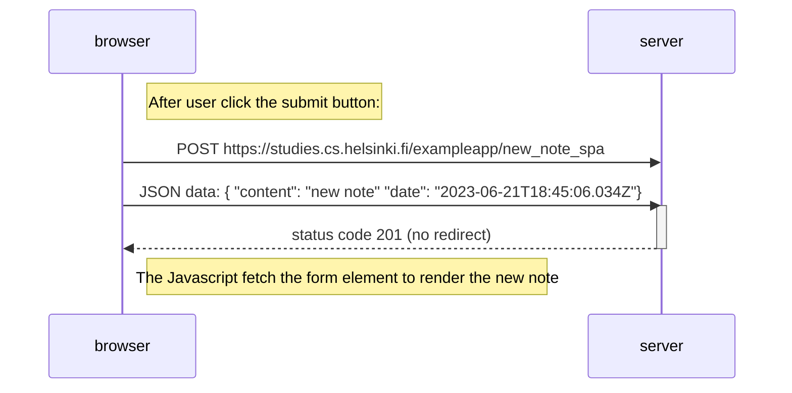

```mermaid
sequenceDiagram
    participant browser
    participant server

    Note right of browser: After user click the submit button:


    browser->>server: POST https://studies.cs.helsinki.fi/exampleapp/new_note_spa
    browser->>server: JSON data: { "content": "new note" "date": "2023-06-21T18:45:06.034Z"}
    activate server
    server-->>browser: status code 201 (no redirect)
    deactivate server

    Note right of browser: The Javascript fetch the form element to render the new note
```